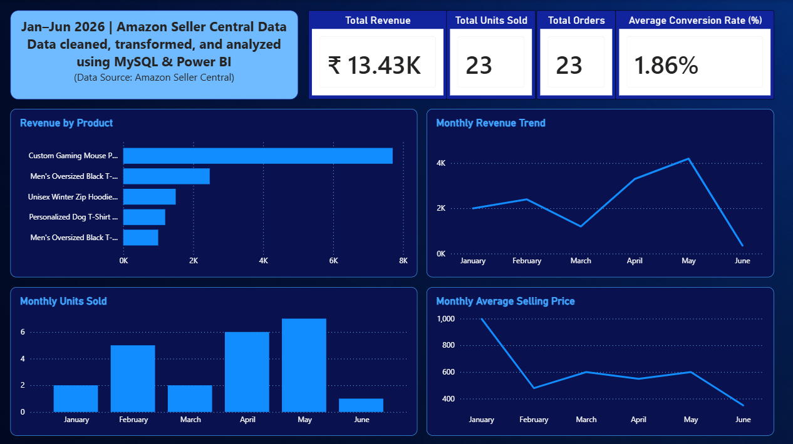

# Amazon Sales Analytics using MySQL & Power BI

## Project Overview
This project analyzes Amazon Seller Central sales data from January–June 2026 using MySQL and Power BI.

## Tools Used
- MySQL
- SQL
- Power BI
- DAX
- Excel

## Key KPIs
- Total Revenue: ₹13.43K
- Total Units Sold: 23
- Total Orders: 23
- Average Conversion Rate: 1.86%

## Dashboard Features
- Revenue by Product
- Monthly Revenue Trend
- Monthly Units Sold
- Monthly Average Selling Price

## SQL Transformations
- Removed currency symbols
- Converted text to numeric values
- Cleaned date fields
- Prepared analytical datasets

## Business Insights
- May generated the highest revenue.
- Custom Gaming Mouse Pad was the top-performing product.
- Units sold peaked in May.

## Dashboard Preview

