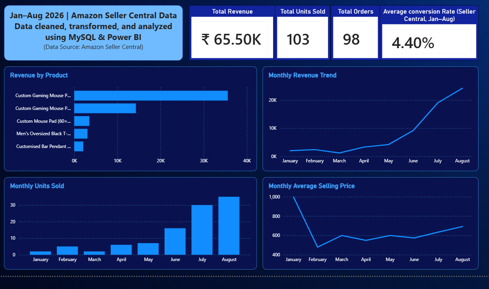

# Amazon Sales Analytics using MySQL & Power BI

## Dashboard Preview

## Project Overview
This project analyzes Amazon Seller Central order data from January–August 2026 (shipped orders) using MySQL and Power BI. Totals reconcile to Seller Central: ₹65,497 and 103 units. Built May 2026 and refreshed with the full data in October 2026.

## Tools Used
- MySQL
- SQL
- Power BI
- DAX
- Excel

## Key KPIs
- Total Revenue: ₹65.50K
- Total Units Sold: 103
- Total Shipped Orders: 98
- Average Order Value: ₹668
- Conversion Rate: 4.4% (taken from Seller Central Business Reports; not calculated from the order file)

## Dashboard Features
- Revenue by Product
- Monthly Revenue Trend
- Monthly Units Sold
- Monthly Average Selling Price

## Data Preparation
- Cleaned order data in Power Query: promoted headers, set data types, fixed dates
- Wrote DAX measures for revenue, orders and average order value
- Set up a MySQL database (sales, orders and product-cost tables); SQL cleaning and KPI queries are in progress

## Business Insights
- August generated the highest revenue; monthly units grew from 2 in January to 35 in August.
- Custom Gaming Mouse Pad was the top-performing product; mousepads made up about 77% of revenue.
- The larger XXL mousepad variant, first sold in late June, became the top seller at about 52% of revenue.
